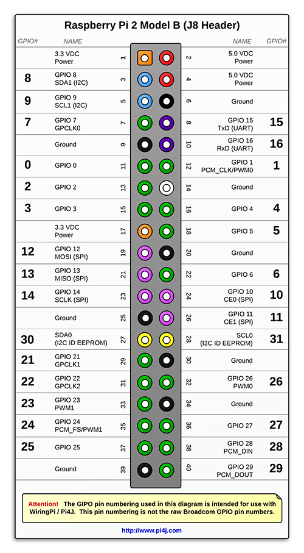

# Pasumai 🌳 
Visit the website @ https://pasumai.samcodee.dev

**Visit a hosted version of this app @ https://pasumai-demo.samcodee.dev**

This is a project made by me ([@samcodee](https://github.com/samcodee)), as an entry to the Yi Thalir Science and Tech Expo (2024-25) and the SOF IITB Techfest Innovation Challenge (2024-25)

This code is not production ready and cannot be distributed. Additional steps are required to get this running.

-----------------------

# How it works

-----------------------

# **Don't want to spend time configuring and running the project locally? There is mock-up online version available: https://pasumai-demo.samcodee.dev**

-----------------------

# Running the project locally

## Requirements:
- A laptop/desktop with NodeJS, Python, Android Studio
- A RaspberryPI* with PiCamera
- A smartphone* (The app is meant for Android but may work in iOS.)

\* - Optional but may not provide the full experience

## 0. Clone the project locally and install dependencies using `yarn`

## 1. Creating an Expo Dev Client
1. Modify the API Key in `app.json` in `RNMapboxMapsDownloadToken` to include your Mapbox API Key*.
2. Run `yarn android` in project root. 
3. This will create an `android` folder.
4. You will get a development client. Install the .APK at `android/app/build/outputs/apk/debug/app-debug.apk` in your mobile phone or emulator.

\* - You must create a Mapbox account if you don't have one and also add the API key to `token.key` and in `/components/MapScreen.tsx`

## 2. Running the React Native App
1. Run `yarn start`. You must have the Android Studio Tools installed. 
2. Press `a` to open the app in the emulator or
scan the QRCode or enter the URL in the app
3. The app should be open. 

## 3. Running the backend 
Go to `/backend`

1. Run `pip install torch uuid random transformers Pillow requests flask`
2. Run `mkdir uploads`
3. If you are **not** using a RaspberryPi and running the Dustbin Software on the same device as the backend, run `python app-qr.py`.
4. If you are using a RaspberryPi or using the Dustbin Software on a different device, you will have to start the Dustbin Software in that device and then change the IP to that device's IP in line `39` in `app-qr.py`, in the `/verify-otp` route handler.

## 4. Running the Dustbin Software
### If you do **not** have a RaspberryPi,
1. Run `pip install qrcode` (You must have the packages in Step 3. Running the backend too installed.)
2. Run `python piapp_desktop.py`. If you have a different device for the backend server, you will have to change the IP of the backend in the `get_and_show_qr_code()` function.
3. A window with QRCode will open.

### If you do have a RaspberryPi,
1. Install the packages `qrcode`, `Pillow`, `tkinter`, RaspberryPi's GPIO and PiCamera packages, `flask`, `requests`, etc.
2. If you want the dustbin to open and close automatically, refer section *"Automatic control of Dustbin Lid"*
3. Connect the PiCamera, enable it in `raspi-config` if you have to.
4. Transfer the piapp.py file. Make sure to add the backend's IP in `Line 79: display_timer()` and `Line 112: get_and_show_qr_code()`
5. Run `python piapp.py`
6. A fullscreen window with the QRCode will open. When the user scans this, the dustbin opens (using the servo).

The clicked image by the phone and the video in the PiCamera in the dustbin is sent to the backend. 

Currently, validation is not done at the dustbin using the camera. However, a basic version of that, using a custom trained model is implemented: 

https://github.com/user-attachments/assets/ea7cb482-adba-4eee-99ba-fcdec0171af0

-----------------------

## Automatic control of Dustbin Lid
Although not the best implementation, it is possible to automatically open and close the dustbin lid.

Requirements: (A lot of this is overcomplicated, because I was using a display HAT.)
- A servo
- PCA9685
- Jumper wires
- Arduino UNO

Add the code in `arduino/withanalog.ino` to the Arduino.

> [!IMPORTANT]
> You will have to change the PWM values in the code for your servo to work. Try tweaking till you get the desired result.

Connect the wiring as follows:

Connect an external power supply to the PCA9685 using the terminal blocks. I used 2*18650 batteries.
Connect a servo (I used SG90) to the PCA9685.

Follow wiring as follows

| PCA9685 | Arduino |
| -------- | ------- |
| Ground | Ground near 5v pin |
| VCC | 5V |
| SCL | A5 |
|  SDA | A4 |

| Arduino | RaspberryPi (2B) |
| -------- | ------- |
| Ground near 5v pin | pin 39 |
| A0 | pin 37 |

(You may have to change the `GPIO_PIN` in `Line 16 in backend/piapp.py`)

Use the following pinout (Courtesy of https://www.pi4j.com/1.2/images/j8header-2b.png)

Everything else should work.
